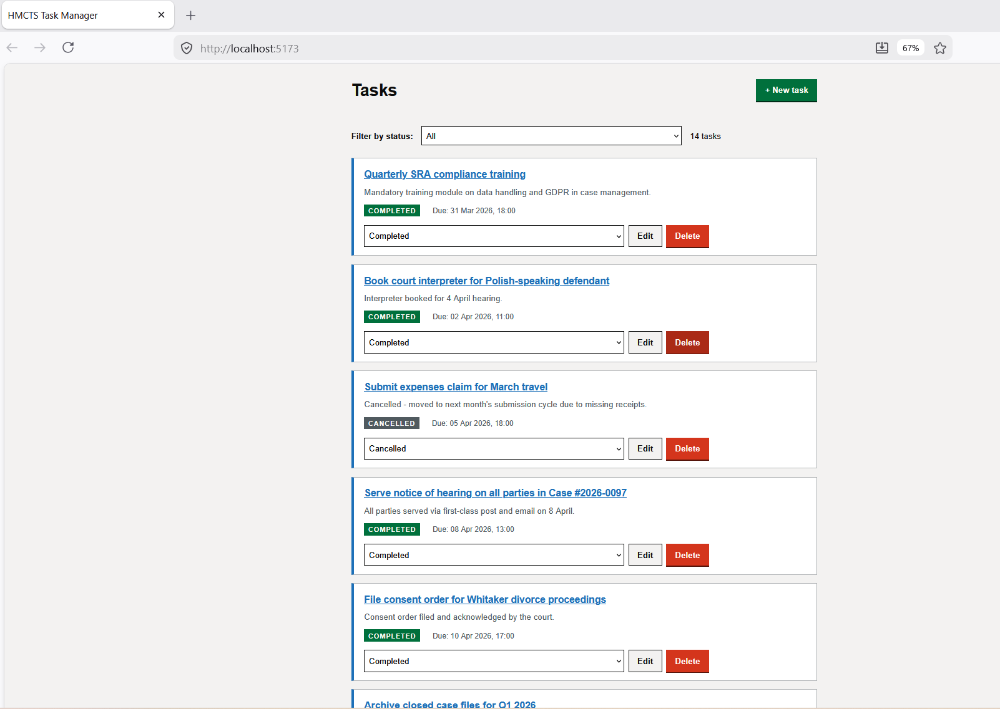
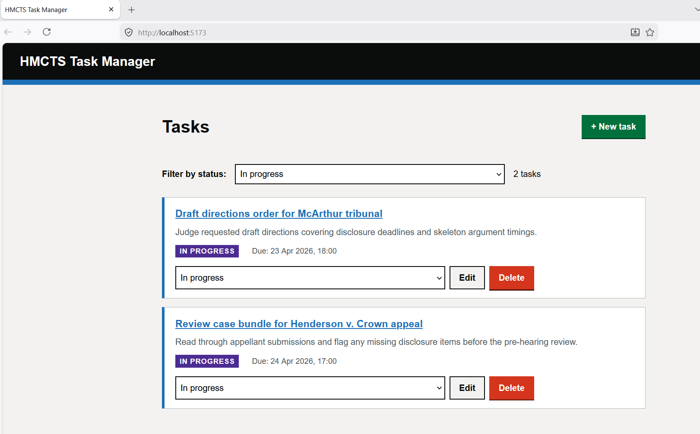
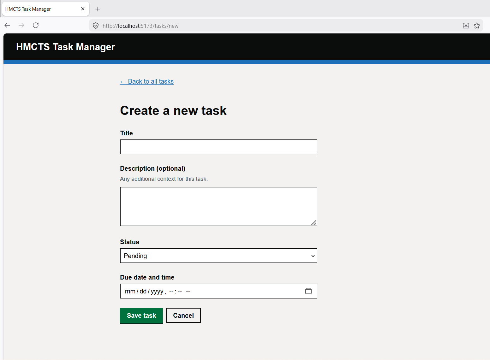
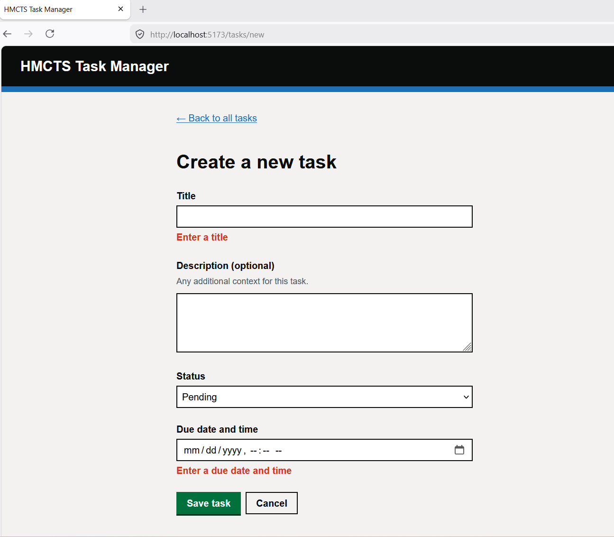
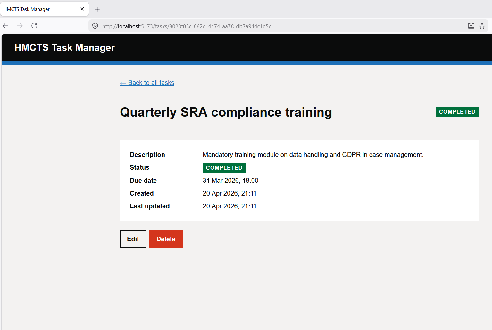
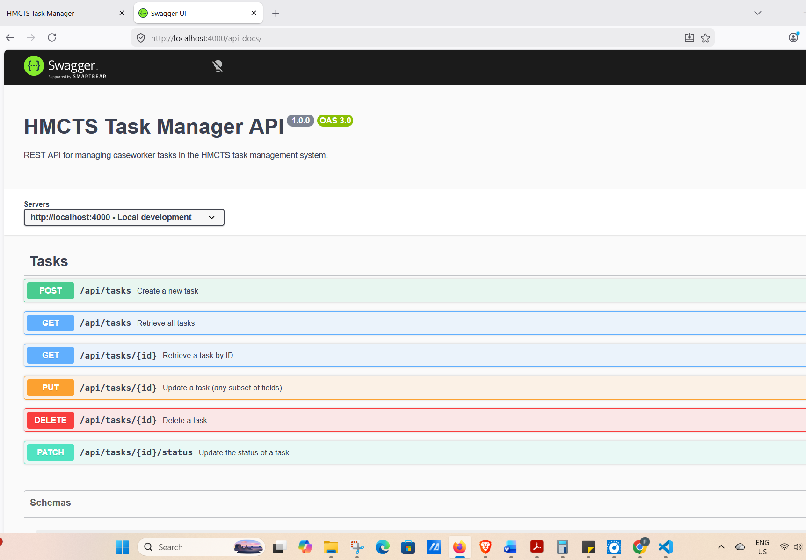

# HMCTS Task Manager

This is my submission for the HMCTS DTS Developer Technical Test. It's a task manager for caseworkers — they can create tasks, check them off, edit them, and delete them. Nothing flashy, but it's built properly: tested, documented, and structured so it would be easy to extend.

## What's in here

```
hmcts-task-manager/
├── backend/            the API
├── frontend/           the web app
├── docker-compose.yml  to run both at once
└── README.md
```

Two separate apps that talk over HTTP. I kept them in one repo because it's easier to review, but they're completely independent — you could pull either one out and use it on its own.

## Screenshots

### Task list

The main landing page. Shows all tasks sorted by due date, with status tags, overdue indicators, and inline status controls.



### Filtering by status

Tasks can be filtered by status from the dropdown at the top.



### Creating a task

The create/edit form, built with accessible labels and GOV.UK-style inputs.



### Validation

Client-side validation prevents submitting obviously invalid data; server-side errors are mapped back to the right field.



### Task detail

Full view of a single task, with edit and delete actions.



### API documentation

Auto-generated Swagger UI at `/api-docs` — every endpoint with a try-it-out harness.



## What I used

**Backend:** Node.js, Express, and SQLite. For the SQLite bit I used Node's built-in `node:sqlite` module instead of the more common `better-sqlite3`, because the built-in one doesn't need any native compilation — you can clone this and run `npm install` without needing Python, build tools, or anything else on your machine. It's been stable in Node since version 22.5. Validation is done with Joi, API docs with Swagger, and tests with Jest + Supertest.

**Frontend:** React with Vite (much faster than Create React App). React Router for navigation, axios for HTTP, and Vitest + React Testing Library for tests. The styling is hand-written CSS in the GOV.UK Design System palette — it feels government-y and it's accessible out of the box.

## Getting it running

You'll need **Node.js 22.5 or newer** (the backend uses `node:sqlite` which needs that version). Check with `node --version`.

### Backend

```bash
cd backend
npm install
npm start
```

That'll start the API on `http://localhost:4000`. The Swagger docs are at `http://localhost:4000/api-docs` — worth having a look there, you can try every endpoint from that page.

> **Heads up for Windows users:** `npm run dev` (which uses nodemon for auto-restart) doesn't play nicely with PowerShell because of how it quotes arguments. Use `npm start` instead — you just have to Ctrl+C and restart when you change code.

### Frontend

Open a second terminal:

```bash
cd frontend
npm install
npm run dev
```

That starts the web app on `http://localhost:5173`. Vite proxies API calls to the backend automatically, so as long as the backend is running too, everything just works.

### Or use Docker

If you've got Docker installed:

```bash
docker-compose up --build
```

Then open `http://localhost:8080`. Data is saved in a Docker volume so your tasks stick around between restarts.

## Running the tests

```bash
cd backend && npm test    # 32 tests
cd frontend && npm test   # 26 tests
```

Both run in under 10 seconds. The backend tests use an in-memory database (so they don't mess with your real data), and the frontend tests mock the API (so they don't need a running backend).

## The API

Six endpoints, all under `/api/tasks`:

| Method | URL | What it does |
|--------|-----|--------------|
| POST | `/api/tasks` | Create a task |
| GET | `/api/tasks` | List all tasks |
| GET | `/api/tasks/:id` | Get one task |
| PATCH | `/api/tasks/:id/status` | Change just the status |
| PUT | `/api/tasks/:id` | Update any fields |
| DELETE | `/api/tasks/:id` | Delete a task |

A task looks like this:

```json
{
  "id": "uuid",
  "title": "string, required, max 200 chars",
  "description": "string or null, optional, max 2000 chars",
  "status": "PENDING | IN_PROGRESS | COMPLETED | CANCELLED",
  "dueDate": "ISO date string, required",
  "createdAt": "ISO date string",
  "updatedAt": "ISO date string"
}
```

A few examples:

```bash
# Make a task
curl -X POST http://localhost:4000/api/tasks \
  -H "Content-Type: application/json" \
  -d '{"title":"Review case bundle","dueDate":"2026-12-31T17:00:00.000Z"}'

# Get everything
curl http://localhost:4000/api/tasks

# Mark one done
curl -X PATCH http://localhost:4000/api/tasks/<id>/status \
  -H "Content-Type: application/json" \
  -d '{"status":"COMPLETED"}'
```

Swagger at `/api-docs` has the full spec and a test harness if you want to poke around without curl.

---

## How the code is organised

### The backend

```
backend/src/
├── server.js             starts the HTTP server
├── app.js                sets up Express
├── config/
│   ├── database.js       SQLite connection + schema
│   └── swagger.js        OpenAPI config
├── routes/               URLs → controllers
├── controllers/          request handlers
├── middleware/           validation + error handling
├── models/               database queries
├── utils/                custom error classes
└── __tests__/            you can guess
```

The idea is a classic layered setup — each file has one job and only talks to the next one down. A request comes in and flows through like this:

```
HTTP request
    ↓
routes           "which function handles this URL?"
    ↓
middleware       "is the body valid? is the user logged in?"
    ↓
controllers      "pull out the params, call the model, send a response"
    ↓
models           "run the SQL"
    ↓
SQLite
```

The nice thing about doing it this way is that each layer is replaceable. If I ever needed to swap SQLite for Postgres, I'd only change one file (`models/taskModel.js`). If I wanted to add authentication, I'd write a middleware and register it once — no controller code needs to change. And tests are easy because you can test any layer without the ones above or below it.

A quick tour of the interesting files:

**`server.js`** just loads the environment, builds the app, and starts listening. It's only about 15 lines.

**`app.js`** is the actual Express setup. I kept it separate from `server.js` because tests need to create fresh Express instances without actually starting a server — this separation (called the "app factory" pattern) makes that clean.

**`config/database.js`** connects to SQLite and creates the table if it doesn't exist. In test mode it uses an in-memory database, so tests don't leave files lying around.

**`routes/taskRoutes.js`** is just URL-to-function mappings, plus the Swagger documentation comments. Those comments are what generate the `/api-docs` page automatically — keeping the docs next to the route means they stay in sync.

**`controllers/taskController.js`** is deliberately thin. No SQL, no business logic — just "grab the parameters, call the model, send back the result." If there's an error, it throws a custom error class and the error middleware handles turning that into a proper HTTP response.

**`models/taskModel.js`** is the only file that talks to the database. All SQL lives here and every query is parameterized (so SQL injection isn't a concern).

**`middleware/validation.js`** uses Joi to check incoming request bodies against a schema. If something's wrong — missing title, invalid status, bad date — it sends back a 400 with a list of which specific fields failed. That's what lets the frontend highlight the right field when something goes wrong.

**`middleware/errorHandler.js`** is the safety net. If anything anywhere throws an error, it gets caught here and turned into a clean JSON response. No stack traces leaking to users, no random 500s.

#### The backend tests

Two files:

- `api.test.js` — 22 integration tests. These spin up a real Express app against an in-memory database and make actual HTTP requests to it. They cover every endpoint, plus all the "what if things go wrong" cases: missing fields, invalid data, unknown IDs, broken JSON, etc.
- `taskModel.test.js` — 10 unit tests for just the database layer. Tests that create/read/update/delete all do what they say and that the edge cases (updating a missing task, for instance) behave sensibly.

### The frontend

```
frontend/src/
├── main.jsx           React startup
├── App.jsx            the routes
├── styles.css         all the CSS
├── services/
│   └── tasksApi.js    talks to the backend
├── utils/
│   └── dates.js       date formatting
├── components/        reusable UI bits
├── pages/             the actual screens
└── __tests__/
```

The split between `components/` and `pages/` is the usual React convention — pages are the things you navigate to (they have URLs), components are the smaller reusable bits that pages are built from.

One thing I was deliberate about: **no component calls the API directly.** Everything goes through `services/tasksApi.js`. It's a thin wrapper around axios that also normalizes errors into a consistent shape, so the pages don't have to worry about whether an error came from the network, the server, or validation — they just get `{ message, details, status }` and can react accordingly. If I ever needed to swap axios for something else, or add auth headers, or change the base URL, it's all in that one file.

The pages are:

- **`TaskListPage`** — the landing page. Shows all tasks, with a status filter, inline status-change dropdowns on each card, and delete-with-confirmation. Handles the usual states: loading, empty, error.
- **`TaskDetailPage`** — the full view of a single task, accessed by clicking a task's title.
- **`TaskFormPage`** — used for both creating and editing. It takes a `mode` prop so I didn't need two nearly-identical components. In edit mode it fetches the task first and pre-fills the form.

The smaller components are `TaskCard` (one row in the list), `TaskForm` (the actual form fields — used inside `TaskFormPage`), `StatusTag` (the little coloured status badge), and `Banner` (for error/success messages at the top of a page).

One small thing worth mentioning: the API uses ISO dates in UTC (`2026-12-31T17:00:00.000Z`), but HTML's `<input type="datetime-local">` wants local time in a completely different format. The helpers in `utils/dates.js` handle the conversion both ways, plus format dates nicely for display and work out whether a task is overdue. It's a small thing but it's the kind of detail that trips people up if you don't think about it.

#### The dev server proxy

The frontend runs on port 5173 and the backend on 4000. When the frontend calls `/api/tasks`, Vite's dev server transparently forwards that to the backend. This avoids all the CORS faff during development, and because the code uses relative URLs, the same build works in production when both are served from the same domain (which is how the Docker setup works).

#### The frontend tests

26 tests across four files:

- `dates.test.js` — just the date helpers. Pure functions, so easy to test thoroughly.
- `StatusTag.test.jsx` — checks the badge renders the right label and class.
- `TaskForm.test.jsx` — form validation, submission, handling server errors, the cancel button.
- `TaskListPage.test.jsx` — full-page tests with a mocked API. Loading state, empty state, error state, filtering, status changes, delete with confirmation, delete with cancelled confirmation.

### Following a request all the way through

To give a sense of how all the layers fit together, here's what happens when you click Delete on a task:

1. You click the Delete button in `TaskCard`
2. That calls the `onDelete` handler that the parent `TaskListPage` passed down
3. `TaskListPage` pops up a `window.confirm` — if you cancel, nothing else happens
4. If you confirm, it calls `tasksApi.remove(id)`
5. Axios fires off `DELETE /api/tasks/<id>` to Vite on port 5173
6. Vite proxies that to the backend on port 4000
7. Express matches the URL against the routes and calls `taskController.deleteTask`
8. The controller calls `taskModel.remove(id)`
9. The model runs `DELETE FROM tasks WHERE id = ?`
10. If the task existed, the controller sends back 204 No Content
11. If it didn't, it throws a `NotFoundError` that the error middleware turns into a 404
12. Back in the frontend, the promise resolves (or throws a normalized error)
13. `TaskListPage` updates its state to remove the task, and the UI re-renders
14. A success banner appears at the top: "Task deleted"

Every layer did one specific thing. That's the pattern throughout.

## Some decisions I made and why

**`node:sqlite` over `better-sqlite3`.** The popular choice is `better-sqlite3`, but it needs to compile native code during install, which means Python and build tools need to be on the reviewer's machine. Node's built-in SQLite module (stable since 22.5) is a drop-in replacement and needs no compilation — anyone can clone and run this without any fuss.

**SQLite rather than Postgres/MySQL.** For a test project where I want the reviewer to be able to run it in 30 seconds, having to set up a database server seemed wrong. The data layer is isolated to one file anyway, so moving to Postgres later is a small change.

**PATCH for status, PUT for everything.** The brief specifically mentions "update the status of a task" as a distinct operation, so it gets its own endpoint. It's more RESTful (PATCH is for partial updates), and since status changes are the most common thing caseworkers will do, it's cheaper to have a dedicated route than to require sending the whole task back each time.

**App factory pattern.** Separating `createApp()` from `server.js` is a small thing but it makes testing much easier — tests can build a fresh Express app against an in-memory database without actually binding to a port.

**No component calls axios directly.** All network calls go through the service layer. This is a tiny thing until it isn't — the moment you need to add auth headers, or retry logic, or change the base URL, you'll be glad there's only one place to change it.

**Accessibility from the start.** The form fields have proper labels, `aria-invalid` and `aria-describedby` for errors, visible focus rings (yellow, GOV.UK style), and destructive actions ask for confirmation. Public-sector services need to meet WCAG 2.1 AA, and retrofitting that onto a finished app is much harder than building it in from the start.

## What the project covers from the brief

Every requirement from the spec, plus a few extras:

**Required:**
- Create tasks with title, optional description, status, and due date ✓
- Get a task by ID ✓
- Get all tasks ✓
- Update status ✓
- Delete ✓
- Frontend for all of the above ✓
- Unit tests ✓
- Database storage ✓
- Validation + error handling ✓
- API documentation ✓

**Extras I added:**
- Full task updates via PUT (not just status changes)
- Status filter on the list page
- Overdue indicator for past-due tasks
- Accessible forms throughout
- Field-level error mapping from server to UI
- Docker Compose for one-command deployment

That's about it. Thanks for reading.
